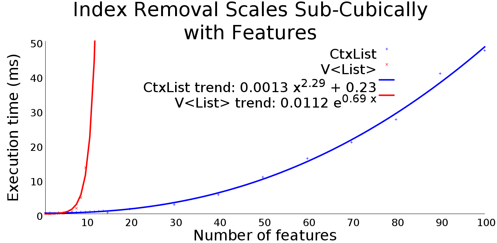

# How To Efficiently Process 2^100 List Variations - Full Benchmark Results

## Basic Iteration
### Benchmark code
```java
for (Integer el : FEList.list) {
    System.out.println(el);
}
```
### Results

<br><br>

## CheckStyle Iteration
### Benchmark code
```java
for (someObj el : FEList.objList) {
    el.longOperation();
}
```
### Results

<br><br>

## Iteration with Feature Condition
### Benchmark code
```java
for (Integer el : FEList.list) {
    if (FEList.E1)
        System.out.println(el);
}
```
### Results

<br><br>

## Iteration Reading Outer Variable
### Benchmark code
```java
Integer n = 42;
for (Integer el : FEList.list) {
    System.out.println(el + n);
}
```
### Results

<br><br>

## Iteration Modifying Outer Variable
### Benchmark code
```java
Integer sum = 0;
for (Integer el : FEList.list) {
    System.out.println(el);
    sum += el;
}
```
### Results

<br><br>

## Finding Element
### Benchmark code
```java
FEList.list.indexOf(610);
```
### Results

<br><br>

## Removing Element
### Benchmark code
```java
FEList.list.remove(Integer.valueOf(610));
```
### Results

<br><br>

## Random Access
### Benchmark code
```java
System.out.println(FEList.list.get(6));
```
### Results

<br><br>

## Remove Index
### Benchmark code
```java
System.out.println(FEList.list.remove(6));
```
### Results

<br><br>

## Size Calculation
### Benchmark code
```java
FEList.list.size();
```
### Results

<br><br>

## Sorting
### Benchmark code
```java
FEList.list.sort(new Comparator() {
    @Override
    public int compare(Object o1, Object o2) {
        Integer i1 = (Integer) o1;
        Integer i2 = (Integer) o2;
        return i1 - i2;
    }
});
```
### Results

<br><br>

## Variational Sorting
### Benchmark code
```java
Comparator<Integer> c;
if (FEList.E1 || FEList.E50)
    c = new Comparator() {
    @Override
    public int compare(Object o1, Object o2) {
        Integer i1 = (Integer) o1;
        Integer i2 = (Integer) o2;
        return i1 - i2;
    }
};
else
    c = new Comparator() {
    @Override
    public int compare(Object o1, Object o2) {
        Integer i1 = (Integer) o1;
        Integer i2 = (Integer) o2;
        return i2 - i1;
    }
};

FEList.list.sort(c);
```
### Results

<br><br>

## List Construction
### Benchmark code
```java
list = new LinkedList<>();

int i = 0;
int startValue = 0;
if (i++ < numFeatures)
    if (E1) addThisMany(10, list, (startValue++)*10);
if (i++ < numFeatures)
    if (E2) addThisMany(10, list, (startValue++)*10);
if (i++ < numFeatures)
    if (E3) addThisMany(10, list, (startValue++)*10);
if (i++ < numFeatures)
    if (E4) addThisMany(10, list, (startValue++)*10);
if (i++ < numFeatures)
    if (E5) addThisMany(10, list, (startValue++)*10);
if (i++ < numFeatures)
    if (E6) addThisMany(10, list, (startValue++)*10);
if (i++ < numFeatures)
    if (E7) addThisMany(10, list, (startValue++)*10);
if (i++ < numFeatures)
    if (E8) addThisMany(10, list, (startValue++)*10);
if (i++ < numFeatures)
    if (E9) addThisMany(10, list, (startValue++)*10);
if (i++ < numFeatures)
    if (E10) addThisMany(10, list, (startValue++)*10);
if (i++ < numFeatures)
    if (E11) addThisMany(10, list, (startValue++)*10);
if (i++ < numFeatures)
    if (E12) addThisMany(10, list, (startValue++)*10);
if (i++ < numFeatures)
    if (E13) addThisMany(10, list, (startValue++)*10);
if (i++ < numFeatures)
    if (E14) addThisMany(10, list, (startValue++)*10);
if (i++ < numFeatures)
    if (E15) addThisMany(10, list, (startValue++)*10);
if (i++ < numFeatures)
    if (E16) addThisMany(10, list, (startValue++)*10);
if (i++ < numFeatures)
    if (E17) addThisMany(10, list, (startValue++)*10);
if (i++ < numFeatures)
    if (E18) addThisMany(10, list, (startValue++)*10);
if (i++ < numFeatures)
    if (E19) addThisMany(10, list, (startValue++)*10);
if (i++ < numFeatures)
    if (E20) addThisMany(10, list, (startValue++)*10);
if (i++ < numFeatures)
    if (E21) addThisMany(10, list, (startValue++)*10);
if (i++ < numFeatures)
    if (E22) addThisMany(10, list, (startValue++)*10);
if (i++ < numFeatures)
    if (E23) addThisMany(10, list, (startValue++)*10);
if (i++ < numFeatures)
    if (E24) addThisMany(10, list, (startValue++)*10);
if (i++ < numFeatures)
    if (E25) addThisMany(10, list, (startValue++)*10);
if (i++ < numFeatures)
    if (E26) addThisMany(10, list, (startValue++)*10);
if (i++ < numFeatures)
    if (E27) addThisMany(10, list, (startValue++)*10);
if (i++ < numFeatures)
    if (E28) addThisMany(10, list, (startValue++)*10);
if (i++ < numFeatures)
    if (E29) addThisMany(10, list, (startValue++)*10);
if (i++ < numFeatures)
    if (E30) addThisMany(10, list, (startValue++)*10);
if (i++ < numFeatures)
    if (E31) addThisMany(10, list, (startValue++)*10);
if (i++ < numFeatures)
    if (E32) addThisMany(10, list, (startValue++)*10);
if (i++ < numFeatures)
    if (E33) addThisMany(10, list, (startValue++)*10);
if (i++ < numFeatures)
    if (E34) addThisMany(10, list, (startValue++)*10);
if (i++ < numFeatures)
    if (E35) addThisMany(10, list, (startValue++)*10);
if (i++ < numFeatures)
    if (E36) addThisMany(10, list, (startValue++)*10);
if (i++ < numFeatures)
    if (E37) addThisMany(10, list, (startValue++)*10);
if (i++ < numFeatures)
    if (E38) addThisMany(10, list, (startValue++)*10);
if (i++ < numFeatures)
    if (E39) addThisMany(10, list, (startValue++)*10);
if (i++ < numFeatures)
    if (E40) addThisMany(10, list, (startValue++)*10);
if (i++ < numFeatures)
    if (E41) addThisMany(10, list, (startValue++)*10);
if (i++ < numFeatures)
    if (E42) addThisMany(10, list, (startValue++)*10);
if (i++ < numFeatures)
    if (E43) addThisMany(10, list, (startValue++)*10);
if (i++ < numFeatures)
    if (E44) addThisMany(10, list, (startValue++)*10);
if (i++ < numFeatures)
    if (E45) addThisMany(10, list, (startValue++)*10);
if (i++ < numFeatures)
    if (E46) addThisMany(10, list, (startValue++)*10);
if (i++ < numFeatures)
    if (E47) addThisMany(10, list, (startValue++)*10);
if (i++ < numFeatures)
    if (E48) addThisMany(10, list, (startValue++)*10);
if (i++ < numFeatures)
    if (E49) addThisMany(10, list, (startValue++)*10);
if (i++ < numFeatures)
    if (E50) addThisMany(10, list, (startValue++)*10);
if (i++ < numFeatures)
    if (E51) addThisMany(10, list, (startValue++)*10);
if (i++ < numFeatures)
    if (E52) addThisMany(10, list, (startValue++)*10);
if (i++ < numFeatures)
    if (E53) addThisMany(10, list, (startValue++)*10);
if (i++ < numFeatures)
    if (E54) addThisMany(10, list, (startValue++)*10);
if (i++ < numFeatures)
    if (E55) addThisMany(10, list, (startValue++)*10);
if (i++ < numFeatures)
    if (E56) addThisMany(10, list, (startValue++)*10);
if (i++ < numFeatures)
    if (E57) addThisMany(10, list, (startValue++)*10);
if (i++ < numFeatures)
    if (E58) addThisMany(10, list, (startValue++)*10);
if (i++ < numFeatures)
    if (E59) addThisMany(10, list, (startValue++)*10);
if (i++ < numFeatures)
    if (E60) addThisMany(10, list, (startValue++)*10);
if (i++ < numFeatures)
    if (E61) addThisMany(10, list, (startValue++)*10);
if (i++ < numFeatures)
    if (E62) addThisMany(10, list, (startValue++)*10);
if (i++ < numFeatures)
    if (E63) addThisMany(10, list, (startValue++)*10);
if (i++ < numFeatures)
    if (E64) addThisMany(10, list, (startValue++)*10);
if (i++ < numFeatures)
    if (E65) addThisMany(10, list, (startValue++)*10);
if (i++ < numFeatures)
    if (E66) addThisMany(10, list, (startValue++)*10);
if (i++ < numFeatures)
    if (E67) addThisMany(10, list, (startValue++)*10);
if (i++ < numFeatures)
    if (E68) addThisMany(10, list, (startValue++)*10);
if (i++ < numFeatures)
    if (E69) addThisMany(10, list, (startValue++)*10);
if (i++ < numFeatures)
    if (E70) addThisMany(10, list, (startValue++)*10);
if (i++ < numFeatures)
    if (E71) addThisMany(10, list, (startValue++)*10);
if (i++ < numFeatures)
    if (E72) addThisMany(10, list, (startValue++)*10);
if (i++ < numFeatures)
    if (E73) addThisMany(10, list, (startValue++)*10);
if (i++ < numFeatures)
    if (E74) addThisMany(10, list, (startValue++)*10);
if (i++ < numFeatures)
    if (E75) addThisMany(10, list, (startValue++)*10);
if (i++ < numFeatures)
    if (E76) addThisMany(10, list, (startValue++)*10);
if (i++ < numFeatures)
    if (E77) addThisMany(10, list, (startValue++)*10);
if (i++ < numFeatures)
    if (E78) addThisMany(10, list, (startValue++)*10);
if (i++ < numFeatures)
    if (E79) addThisMany(10, list, (startValue++)*10);
if (i++ < numFeatures)
    if (E80) addThisMany(10, list, (startValue++)*10);
if (i++ < numFeatures)
    if (E81) addThisMany(10, list, (startValue++)*10);
if (i++ < numFeatures)
    if (E82) addThisMany(10, list, (startValue++)*10);
if (i++ < numFeatures)
    if (E83) addThisMany(10, list, (startValue++)*10);
if (i++ < numFeatures)
    if (E84) addThisMany(10, list, (startValue++)*10);
if (i++ < numFeatures)
    if (E85) addThisMany(10, list, (startValue++)*10);
if (i++ < numFeatures)
    if (E86) addThisMany(10, list, (startValue++)*10);
if (i++ < numFeatures)
    if (E87) addThisMany(10, list, (startValue++)*10);
if (i++ < numFeatures)
    if (E88) addThisMany(10, list, (startValue++)*10);
if (i++ < numFeatures)
    if (E89) addThisMany(10, list, (startValue++)*10);
if (i++ < numFeatures)
    if (E90) addThisMany(10, list, (startValue++)*10);
if (i++ < numFeatures)
    if (E91) addThisMany(10, list, (startValue++)*10);
if (i++ < numFeatures)
    if (E92) addThisMany(10, list, (startValue++)*10);
if (i++ < numFeatures)
    if (E93) addThisMany(10, list, (startValue++)*10);
if (i++ < numFeatures)
    if (E94) addThisMany(10, list, (startValue++)*10);
if (i++ < numFeatures)
    if (E95) addThisMany(10, list, (startValue++)*10);
if (i++ < numFeatures)
    if (E96) addThisMany(10, list, (startValue++)*10);
if (i++ < numFeatures)
    if (E97) addThisMany(10, list, (startValue++)*10);
if (i++ < numFeatures)
    if (E98) addThisMany(10, list, (startValue++)*10);
if (i++ < numFeatures)
    if (E99) addThisMany(10, list, (startValue++)*10);
if (i++ < numFeatures)
    if (E100) addThisMany(10, list, (startValue++)*10);

// Ensure that list contains at least ten elements
addThisMany(10, list, (startValue++)*10);
```
### Results

<br><br>
