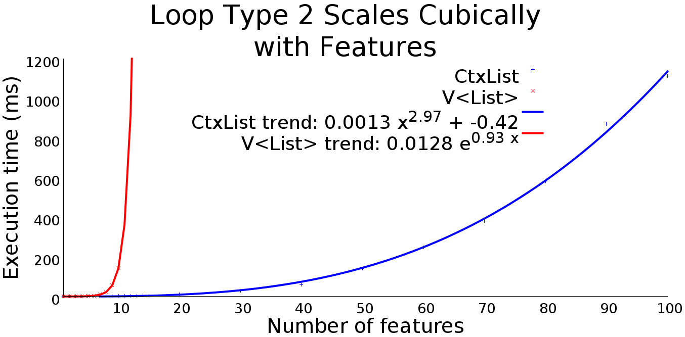
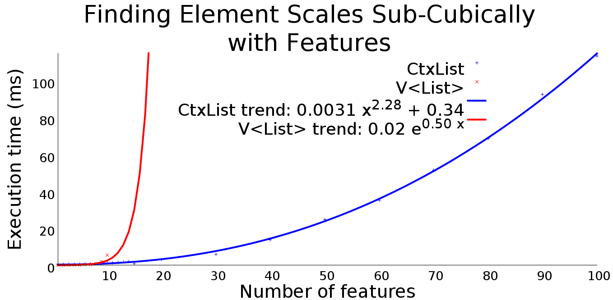

# How To Efficiently Process 2^100 List Variations - Full Benchmark Results

## Basic Iteration
### Benchmark code
```java
for (Integer el : FEList.list) {
    System.out.println(el);
}
```
### Results


## CheckStyle Iteration
### Benchmark code
```java
for (someObj el : FEList.objList) {
    el.longOperation();
}
```
### Results


## Iteration with Feature Condition
### Benchmark code
```java
for (Integer el : FEList.list) {
    if (FEList.E1)
        System.out.println(el);
}
```
### Results


## Iteration Reading Outer Variable
### Benchmark code
```java
Integer n = 42;
for (Integer el : FEList.list) {
    System.out.println(el + n);
}
```
### Results


## Iteration Modifying Outer Variable
### Benchmark code
```java
Integer sum = 0;
for (Integer el : FEList.list) {
    System.out.println(el);
    sum += el;
}
```
### Results



## Finding Element
### Benchmark code
```java
FEList.list.indexOf(610);
```
### Results



## Removing Element
### Benchmark code
```java
FEList.list.remove(Integer.valueOf(610));
```
### Results


## Random Access
### Benchmark code
```java
System.out.println(FEList.list.get(6));
```
### Results


## Remove Index
### Benchmark code
```java
System.out.println(FEList.list.remove(6));
```
### Results


## Size Calculation
### Benchmark code
```java
FEList.list.size();
```
### Results


## Sorting
### Benchmark code
```java
FEList.list.sort(new Comparator() {
    @Override
    public int compare(Object o1, Object o2) {
        Integer i1 = (Integer) o1;
        Integer i2 = (Integer) o2;
        return i1 - i2;
    }
});
```
### Results


## Variational Sorting
### Benchmark code
```java
Comparator<Integer> c;
if (FEList.E1 || FEList.E50)
    c = new Comparator() {
    @Override
    public int compare(Object o1, Object o2) {
        Integer i1 = (Integer) o1;
        Integer i2 = (Integer) o2;
        return i1 - i2;
    }
};
else
    c = new Comparator() {
    @Override
    public int compare(Object o1, Object o2) {
        Integer i1 = (Integer) o1;
        Integer i2 = (Integer) o2;
        return i2 - i1;
    }
};

FEList.list.sort(c);
```
### Results


## List Construction
### Benchmark code
```java
list = new LinkedList<>();

int i = 0;
int startValue = 0;
if (i++ < numFeatures)
    if (E1) addThisMany(10, list, (startValue++)*10);
if (i++ < numFeatures)
    if (E2) addThisMany(10, list, (startValue++)*10);
if (i++ < numFeatures)
    if (E3) addThisMany(10, list, (startValue++)*10);
// ... So on to E100 ...

// Ensure that list contains at least ten elements
addThisMany(10, list, (startValue++)*10);
```
### Results


